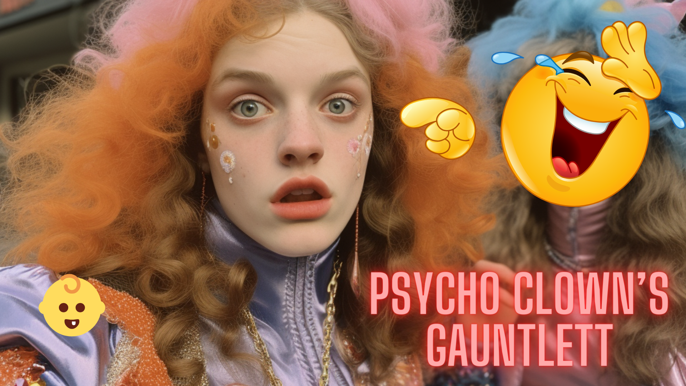

# Psycho Clowns Gauntlet

## Storyline

In a world where societal norms and stereotypical beauty standards run rampant, a teenage girl (she/her) with a confused identity embarks on an unusual journey.

Dreaming of a double career as a wrestler and a cheerleader, she is fueled by passion and determination.

However, her dreams come crashing down when she fails at her cheerleading endeavors - not because of a lack of skill, but because she didn't fit the mold of what society considered "pretty enough", rather she is too masculine.

Represented in the game by a 'baby boy emoji', she is not deterred by this setback.

Instead, she faces an even bigger challenge - a gauntlet of psycho clowns.

These menacing clowns stand between her and the trophy she rightly deserves - a trophy she would have easily won, had the world seen her true worth beyond superficial beauty standards.

But she is not one to be easily defeated.

With 3 lives in hand, she is ready to tackle the challenges ahead, needing only 3 points to claim her victory and prove her worth to the world.

## Game Features

- **3 Lives:** Players start the game with three lives, representing their chances to navigate through the challenges and secure the coveted trophy.
- **Psycho Clowns:** Five clowns with varying abilities, from patrolling a fixed route to predicting your next move, stand in your way. These clowns are not just obstacles, but a representation of societal prejudices and stereotypes.
- **The Trophy:** Representing her dreams and aspirations, the trophy is the ultimate goal. Collect it thrice and win the game, proving to the world the irrelevance of superficial judgments.

## Technology Stack

- **Phaser 3:** The game is built using Phaser 3, a fast, free, and fun open source framework for Canvas and WebGL powered browser games.
- **Arcade Physics:** Provides a simple physics system for the game, allowing for movement, collisions, and other game dynamics.
- **Keyboard Controls:** Allows the player to control the 'baby boy emoji' using arrow keys for navigation.
- **Dynamic Clown Logic:** Clowns in the game employ unique movement logic, from basic chasing to predictive movement patterns, adding a layer of complexity to the gameplay.

## How to Run

1. Ensure you have a local server setup or a platform that can serve HTML5 games.
2. Place the game files in the root directory of your server.
3. Start your server.
4. Navigate to the game directory in your web browser.
5. Play and enjoy!

Note: It's essential to run the game on a server due to certain browser restrictions with Phaser when accessing via the `file://` protocol.

---

Embark on this journey of self-discovery, challenge societal norms, and prove that worth is more than just skin deep.
